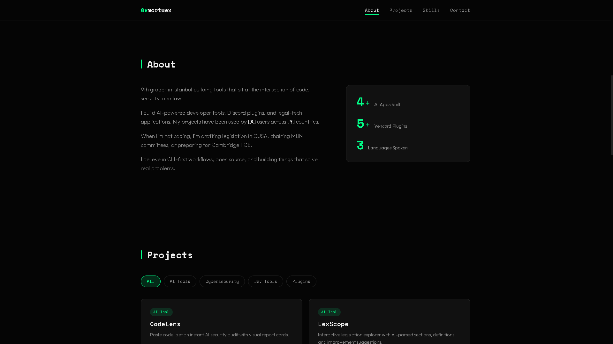

# 0xmortuex — Portfolio

My portfolio site, built as an interactive desktop operating system. Browse my projects, open a terminal, explore files — all in the browser.

## Features

- Boot sequence with fake kernel messages
- Login screen with particle animation
- Draggable, resizable windows with z-index management
- Taskbar with start menu, system tray, and real clock
- 9 built-in apps: About, Projects, Terminal, Files, Browser, Notepad, Settings, Music, Contact
- Working terminal with 20+ commands including `neofetch`, `hack`, `matrix`
- File explorer that fetches real repo data from GitHub API
- Mini browser with iframe for live project demos
- Procedural ambient music via Web Audio API
- Settings: wallpaper, theme, display name, boot toggle
- Desktop shortcuts, context menus, toast notifications
- All settings persist via localStorage
- Fully responsive — mobile gets a simplified full-screen app experience

## Easter Eggs

- Press `` ` `` (backtick) anywhere to open terminal
- Type `konami` in terminal
- Type `matrix` for Matrix rain effect
- Type `hack` for a fake hacking animation
- Right-click desktop → View Source

## Built With

- Vanilla HTML, CSS, JavaScript
- Zero dependencies, zero frameworks
- Google Fonts (Syne, Outfit, JetBrains Mono)
- GitHub API (public, no key)
- Web Audio API for procedural music

## Live

**[https://0xmortuex.github.io](https://0xmortuex.github.io)**

## License

MIT